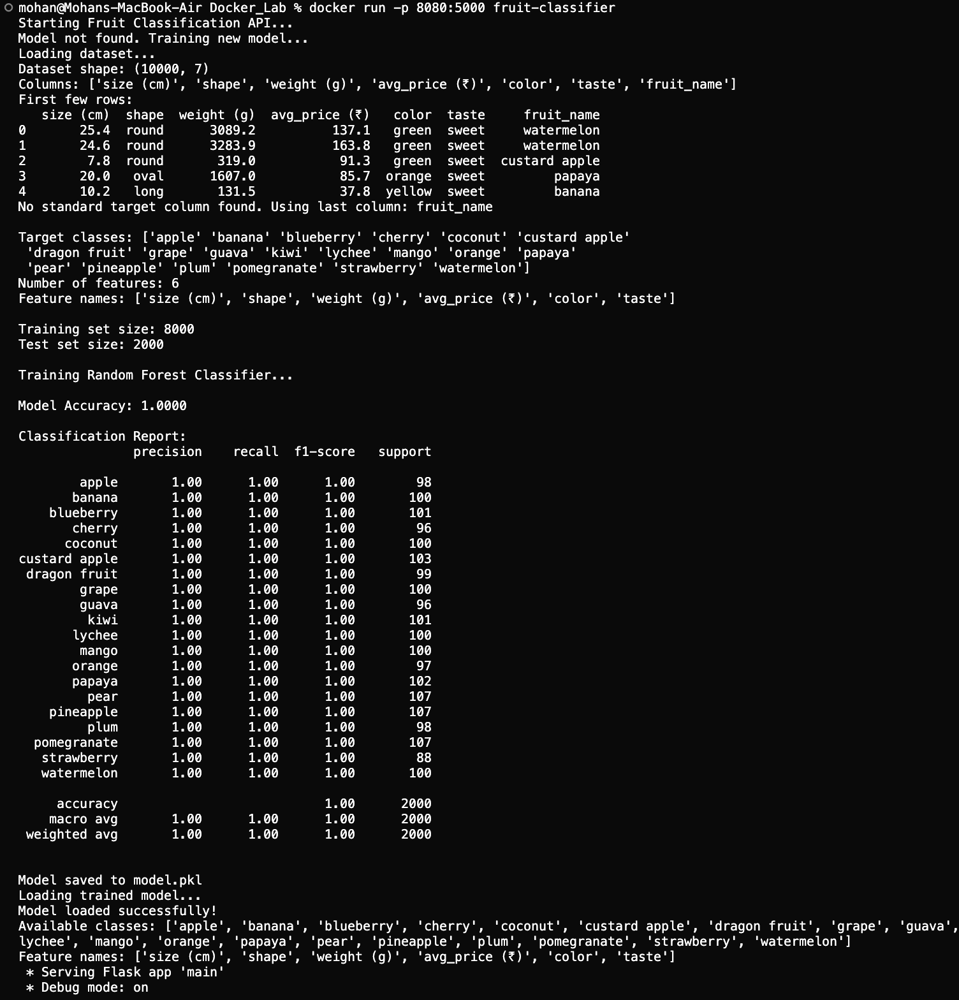

# Docker Lab: Fruit Classification 

**Author:** Mohan Bhosale  
**Course:** MLOps Class

A Dockerized machine learning application for fruit classification using the [Fruit Classification Dataset](https://www.kaggle.com/datasets/pranavkapratwar/fruit-classification) from Kaggle. This lab demonstrates containerization of an ML application with a Flask web service for making predictions.

## Table of Contents

- [Project Overview](#project-overview)
- [How Docker is Used in This Lab](#how-docker-is-used-in-this-lab)
- [Project Structure](#project-structure)
- [Prerequisites](#prerequisites)
- [Setup Instructions](#setup-instructions)
- [Usage](#usage)
- [API Documentation](#api-documentation)
- [Model Details](#model-details)
- [Docker Commands Reference](#docker-commands-reference)
- [Troubleshooting](#troubleshooting)
- [Dependencies](#dependencies)
- [Learning Objectives](#learning-objectives)

## Project Overview

This project implements a complete machine learning pipeline that:
- Loads and preprocesses fruit classification data
- Trains a Random Forest classifier
- Saves the trained model
- Provides a web interface for making predictions
- Runs everything in a Docker container

## How Docker is Used in This Lab

This lab demonstrates the practical application of Docker for containerizing machine learning applications. Here's how Docker is utilized:

### Containerization Process

1. **Dockerfile Definition**: The `dockerfile` defines the complete environment needed to run the application:
   - Base image: Python 3.9 runtime
   - Working directory: `/app` inside the container
   - Dependencies: All Python packages from `requirements.txt` are installed
   - Application code: Source code and data are copied into the container
   - Port exposure: Port 5000 is exposed for the Flask web service
   - Startup command: The application runs automatically when the container starts

2. **Image Building**: When you run `docker build`, Docker:
   - Creates a layered image containing the Python runtime, dependencies, and application code
   - Uses layer caching to optimize rebuilds (dependencies are cached separately from code)
   - Packages everything into a single, portable image file

3. **Container Execution**: When you run `docker run`, Docker:
   - Creates an isolated container from the image
   - Starts the Flask application inside the container
   - Maps the container's port 5000 to your host machine's port 5000
   - Provides complete isolation from your host system

### Benefits Demonstrated

- **Environment Consistency**: The application runs identically on any machine with Docker installed, regardless of the host operating system or Python version
- **Dependency Management**: All dependencies (Flask, pandas, scikit-learn, etc.) are bundled in the container, eliminating "works on my machine" issues
- **Isolation**: The application runs in its own isolated environment, preventing conflicts with other software
- **Portability**: The entire application can be shared as a single Docker image
- **Reproducibility**: Anyone can run the exact same environment by pulling the Docker image

### Docker Workflow in This Lab

```
Source Code + Dockerfile
        |
        v
docker build (creates image)
        |
        v
Docker Image (contains everything)
        |
        v
docker run (creates container)
        |
        v
Running Application (accessible via http://localhost:5000)
```

This workflow ensures that the ML application, its dependencies, and runtime environment are all packaged together, making deployment and sharing straightforward.

## Project Structure

```
Docker_Lab/
├── data/
│   └── Fruit Classification Dataset.csv  # Dataset file (you need to add this)
├── images/
│   ├── docker_build.png                 # Docker build process screenshot
│   ├── Fruit Classifier Inputs.png      # Web interface screenshot
│   └── Prediction Results.png           # Prediction results screenshot
├── src/
│   ├── main.py              # Flask web service
│   ├── train_model.py       # Model training logic
│   └── templates/
│       └── predict.html     # Web interface for predictions
├── dockerfile               # Docker image configuration
├── requirements.txt         # Python dependencies
└── README.md               # This file
```

## Prerequisites

- Docker installed on your system
- The Fruit Classification Dataset CSV file from Kaggle

## Setup Instructions

### 1. Add the Dataset

1. Download the "Fruit Classification Dataset" from [Kaggle](https://www.kaggle.com/datasets/pranavkapratwar/fruit-classification)
2. Place the CSV file in the `data/` directory
3. Rename it to `Fruit Classification Dataset.csv` (if needed)

### 2. Build the Docker Image

Navigate to the `Docker_Lab` directory and build the Docker image:

```bash
cd Docker_Lab
docker build -t fruit-classifier .
```

This command will:
- Create a Docker image based on Python 3.9
- Install all required dependencies from `requirements.txt`
- Copy the application code and data into the container
- Create a portable image that can be run anywhere Docker is installed

**Docker Build Process:**

The build process creates multiple layers, each representing a step in the Dockerfile. Here's my example of the build output:



This demonstrates Docker's layer caching mechanism, where each step (FROM, WORKDIR, COPY, RUN) creates a new layer. If only your source code changes, Docker can reuse cached layers for dependencies, making subsequent builds faster.

### 3. Run the Docker Container

Run the container and map port 5000:

```bash
docker run -p 5000:5000 fruit-classifier
```

The application will:
- Check if a trained model exists
- If not, train a new model on startup (this may take a few minutes)
- Start the Flask web service on port 5000

### 4. Access the Web Service

Open your web browser and navigate to:
- Home: http://localhost:5000
- Prediction Interface: http://localhost:5000/predict

## Usage

### Making Predictions

1. Visit http://localhost:5000/predict in your browser
2. Fill in the form with the fruit features (the form will automatically adapt to your dataset's columns)
3. Click "Predict Fruit" to get the classification result
4. The result will show:
   - The predicted fruit class
   - Probability scores for all classes

**Web Interface:**

The application provides a user-friendly web interface for making predictions. The form automatically adapts to your dataset's features, showing:
- Number inputs for numerical features (size, weight, price)
- Dropdown menus for categorical features (shape, color, taste)


**Prediction Results:**

After submitting the form, the application displays:
- The predicted fruit class with the highest confidence
- Probability scores for all possible fruit classes
- Visual probability bars for easy interpretation


This demonstrates the successful deployment of a machine learning model using Docker, with a fully functional web interface for real-time predictions.

## API Documentation

### GET `/`

Returns a welcome message.

### GET `/predict`

Renders the prediction form HTML page.

### POST `/predict`

Makes a prediction based on provided features.

**Request Format:**
- Form data with feature names as keys and numeric values

**Response Format:**
```json
{
  "predicted_class": "Apple",
  "predicted_class_index": 0,
  "probabilities": {
    "Apple": 0.85,
    "Banana": 0.10,
    "Orange": 0.05
  }
}
```

### GET `/health`

Health check endpoint that returns the status of the service.

## Model Details

- **Algorithm**: Random Forest Classifier
- **Parameters**:
  - `n_estimators`: 100
  - `max_depth`: 10
  - `random_state`: 42
- **Training**: The model is trained on 80% of the data, with 20% reserved for testing
- **Preprocessing**: 
  - Handles missing values
  - Encodes categorical features
  - Standardizes feature names

## Docker Commands Reference

```bash
# Build the image
docker build -t fruit-classifier .

# Run the container
docker run -p 5000:5000 fruit-classifier

# Run in detached mode (background)
docker run -d -p 5000:5000 fruit-classifier

# View running containers
docker ps

# View container logs
docker logs <container_id>

# Stop a container
docker stop <container_id>

# Remove a container
docker rm <container_id>

# Remove the image
docker rmi fruit-classifier
```

## Troubleshooting

### Model Training Fails
- Ensure the dataset file is in the `data/` directory
- Check that the file is named exactly `Fruit Classification Dataset.csv`
- Verify the CSV file is not corrupted

### Port Already in Use
If port 5000 is already in use, map to a different port:
```bash
docker run -p 8080:5000 fruit-classifier
```
Then access the service at http://localhost:8080

### Container Won't Start
- Check Docker is running: `docker ps`
- View container logs: `docker logs <container_id>`
- Ensure all files are in the correct directories

## Dependencies

- **Flask**: Web framework for the API
- **pandas**: Data manipulation and analysis
- **scikit-learn**: Machine learning library
- **joblib**: Model serialization
- **numpy**: Numerical computing

## Learning Objectives

This lab demonstrates:
1. Containerizing ML applications with Docker
2. Building Docker images from Dockerfiles
3. Running containerized applications
4. Creating web services for ML models
5. Handling data preprocessing and model training
6. Serving predictions through a web interface
7. Understanding Docker layer caching and optimization
8. Deploying ML models in isolated, portable containers

## Notes

- The model is saved as `model.pkl` in the container
- On first run, model training may take several minutes depending on dataset size
- The web interface automatically adapts to your dataset's feature columns
- All predictions are made in real-time using the trained model
- The Docker image contains everything needed to run the application, making it highly portable


