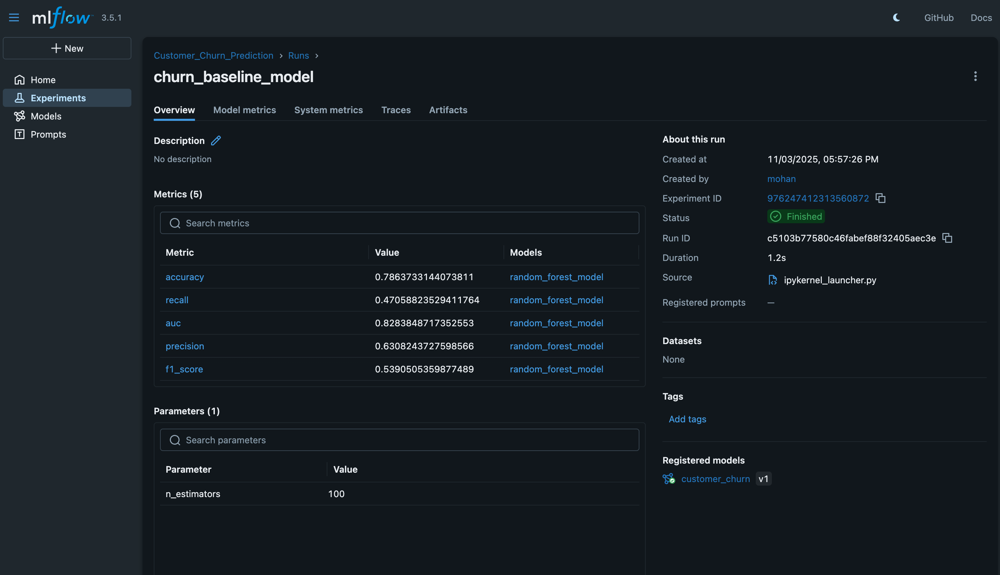
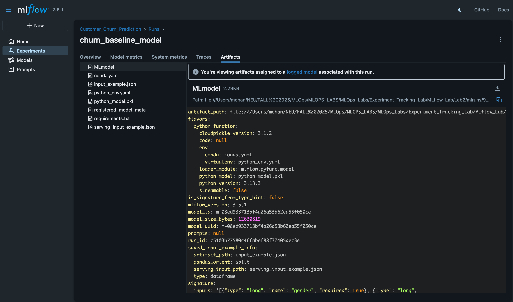

# Customer Churn Prediction with MLflow - Complete MLOps Pipeline

**Author:** Mohan Bhosale  
**Date:** October 2025  
**Course:** MLOps - Fall 2025

---

## Overview

This lab demonstrates a complete **MLOps workflow** using **MLflow** for experiment tracking, model versioning, and deployment. The pipeline predicts customer churn (Yes/No) based on customer characteristics using a Random Forest classifier.

### Key Technologies
- **MLflow 3.0**: Experiment tracking, model registry, and deployment
- **Scikit-learn**: Machine learning algorithms
- **Pandas**: Data processing and manipulation
- **Python**: ML development and deployment
- **Jupyter Notebooks**: Interactive development and experimentation

---

## What This Lab Demonstrates

This lab provides a comprehensive end-to-end MLOps pipeline that demonstrates:

1. **Data Preprocessing** - Handle missing values, encode categorical variables, and prepare data for modeling
2. **Feature Engineering** - Create meaningful features (tenure groups, charge ratios) to improve predictions
3. **Model Training** - Train a Random Forest classifier with MLflow tracking to log all parameters and metrics
4. **Model Registry** - Register and version models in MLflow Model Registry for centralized management
5. **Stage Management** - Transition models through stages (None → Production) for deployment workflows
6. **Batch Inference** - Perform batch predictions on datasets using production models
7. **Real-Time Serving** - Deploy models as REST APIs for real-time predictions

---

## Dataset

**Source:** [Telco Customer Churn Dataset (Kaggle)](https://www.kaggle.com/datasets/blastchar/telco-customer-churn)

The dataset contains approximately 7,043 customer records with 21 features:

| Feature | Description |
|---------|-------------|
| `customerID` | Unique identifier for each customer |
| `gender` | Customer gender (Male/Female) |
| `SeniorCitizen` | Whether customer is a senior citizen (0/1) |
| `Partner` | Whether customer has a partner (Yes/No) |
| `Dependents` | Whether customer has dependents (Yes/No) |
| `tenure` | Number of months customer has been with company |
| `PhoneService` | Whether customer has phone service (Yes/No) |
| `MultipleLines` | Whether customer has multiple lines (Yes/No/No phone service) |
| `InternetService` | Type of internet service (DSL/Fiber optic/No) |
| `OnlineSecurity` | Whether customer has online security (Yes/No/No internet) |
| `OnlineBackup` | Whether customer has online backup (Yes/No/No internet) |
| `DeviceProtection` | Whether customer has device protection (Yes/No/No internet) |
| `TechSupport` | Whether customer has tech support (Yes/No/No internet) |
| `StreamingTV` | Whether customer has streaming TV (Yes/No/No internet) |
| `StreamingMovies` | Whether customer has streaming movies (Yes/No/No internet) |
| `Contract` | Contract type (Month-to-month/One year/Two year) |
| `PaperlessBilling` | Whether customer has paperless billing (Yes/No) |
| `PaymentMethod` | Payment method (Electronic check/Mailed check/Bank transfer/Credit card) |
| `MonthlyCharges` | Monthly charges amount |
| `TotalCharges` | Total charges amount (may have missing values) |
| `Churn` | Whether customer churned (Yes/No) - **Target Variable** |

**Our Approach:** Binary classification to predict customer churn:
- **Churn (1)**: Customer left the company
- **No Churn (0)**: Customer stayed

**Class Distribution:**
- No Churn: ~73% of customers
- Churn: ~27% of customers (slightly imbalanced)

---

## Prerequisites

### Required Software
- **Python 3.8 or higher**
- **Jupyter Notebook** (or JupyterLab)
- **pip** (Python package manager)

### Required Libraries
Install all dependencies from the requirements file:
```bash
pip install -r Lab2/requirements.txt
```

### Dataset
Download the Telco Customer Churn dataset from Kaggle:
- **URL**: https://www.kaggle.com/datasets/blastchar/telco-customer-churn
- **File Name**: `WA_Fn-UseC_-Telco-Customer-Churn.csv`
- Place in `Lab2/data/` directory

---

## Setup Instructions

### Step 1: Navigate to Lab Directory

```bash
cd "/Users/mohan/NEU/FALL 2025/MLOps/MLOPS_LABS/MLOps_Labs/Experiment_Tracking_Lab/MLflow_Lab"
```

### Step 2: Create Virtual Environment (Recommended)

```bash
# Create virtual environment
python3 -m venv mlflow_env

# Activate virtual environment
# On macOS/Linux:
source mlflow_env/bin/activate

# On Windows:
mlflow_env\Scripts\activate
```

### Step 3: Install Dependencies

```bash
# Install Lab 2 dependencies
cd Lab2
pip install -r requirements.txt
```

### Step 4: Download Dataset

1. Go to https://www.kaggle.com/datasets/blastchar/telco-customer-churn
2. Download the dataset (requires Kaggle account)
3. Extract the CSV file: `WA_Fn-UseC_-Telco-Customer-Churn.csv`
4. Place the file in: `Lab2/data/WA_Fn-UseC_-Telco-Customer-Churn.csv`

### Step 5: Start Jupyter Notebook

```bash
# From the MLflow_Lab directory
jupyter notebook
```

---

## Running the Lab

### Lab 2: Complete Pipeline

1. Open `Lab2/starter.ipynb` in Jupyter
2. Run cells sequentially (follow the notebook structure)
3. Complete all steps:
   - Data loading and exploration
   - Preprocessing
   - Feature engineering
   - Model training
   - Model registration
   - Model deployment

**Expected Results:**
- Model trained with ROC-AUC ~0.85
- Model registered in Model Registry
- Model transitioned to Production stage
- Batch inference completed
- Real-time serving working

**Detailed instructions:** See `Lab2/README.md` for comprehensive step-by-step guide

---

## Understanding the Results

### MLflow UI

After running the lab, launch MLflow UI:

```bash
mlflow ui --port=5001
```

Open http://localhost:5001 in your browser to see:

1. **Experiments List**: All your experiments
2. **Runs**: Each training run with metrics and parameters
3. **Model Registry**: Registered models and their versions
4. **Artifacts**: Saved models and files

### Key Metrics to Look For

**Lab 2:**
- **ROC-AUC**: ~0.85 (primary metric for churn prediction)
- **Accuracy**: ~0.80-0.85
- **Feature Importance**: Top features identified (e.g., tenure, monthly charges)

### Model Registry

In Lab 2, you'll see:
- **Registered Model**: `customer_churn`
- **Version**: Version number (1, 2, etc.)
- **Stage**: None → Production
- **Model Path**: `models:/customer_churn/production`

### MLflow UI Screenshots

After completing the lab, the MLflow UI provides detailed information about the trained model. Below are screenshots from the MLflow UI showing the model details and artifacts:

#### Model Run Details

The following screenshot shows the detailed information about the trained model run, including parameters, metrics, and metadata:



This view displays:
- **Run Parameters**: Hyperparameters used during training (e.g., n_estimators, max_depth)
- **Metrics**: Performance metrics (ROC-AUC, accuracy, precision, recall, F1-score)
- **Run Metadata**: Run ID, experiment name, start time, duration
- **Model Information**: Model name, version, and registration status

#### Model Artifacts

The following screenshot shows the artifacts saved during the model training run:



This view displays:
- **Saved Model**: The trained Random Forest model saved in MLflow format
- **Model Signature**: Input/output schema for the model
- **Model Files**: All files associated with the model (code, dependencies, etc.)
- **Model Metadata**: Information about how the model was created and can be used

These screenshots demonstrate the complete tracking and versioning capabilities of MLflow, showing how all aspects of the model training process are captured and organized in the MLflow UI.

---

## Project Structure

```
MLflow_Lab/
├── Lab2/
│   ├── starter.ipynb              # Complete pipeline notebook
│   ├── README.md                  # Detailed step-by-step guide
│   ├── requirements.txt           # Lab 2 dependencies
│   ├── data/
│   │   ├── README.md              # Dataset download instructions
│   │   └── WA_Fn-UseC_-Telco-Customer-Churn.csv  # Dataset (download required)
│   └── Screenshots/               # MLflow UI screenshots
│       ├── churn_baseline_modal_details.png    # Model run details screenshot
│       └── churn_baseline_modal_artifacts.png   # Model artifacts screenshot
│
├── README.md                      # This file (main documentation)
└── SUBMISSION_GUIDE.md           # Guide for completing and submitting the lab
```

---

## Key Concepts Covered

### MLflow Components

1. **MLflow Tracking**
   - Experiments: Organize runs into groups
   - Runs: Individual training executions
   - Parameters: Hyperparameters (n_estimators, max_depth, etc.)
   - Metrics: Performance metrics (accuracy, AUC, etc.)
   - Artifacts: Saved models, plots, files

2. **MLflow Models**
   - Model Signatures: Input/output schemas
   - Model Flavors: Different model types (sklearn, pyfunc, etc.)
   - Model Loading: Load models from runs or registry

3. **MLflow Model Registry**
   - Model Registration: Register models for versioning
   - Version Management: Track model versions
   - Stage Transitions: Move models through stages (None → Production)
   - Model Aliases: Reference models by name and stage

4. **MLflow Deployment**
   - Batch Inference: Predict on datasets
   - Real-Time Serving: REST API for predictions
   - Model Serving: Deploy models as services

### MLflow APIs Used

- `mlflow.start_run()` - Create a new run
- `mlflow.log_param()` - Log hyperparameters
- `mlflow.log_metric()` - Log metrics
- `mlflow.log_model()` - Save models
- `mlflow.register_model()` - Register in Model Registry
- `mlflow.pyfunc.load_model()` - Load models
- `mlflow.models.serve()` - Serve models as REST API

---

## Troubleshooting

### Issue: "File not found" error

**Solution:**
- Ensure the dataset is downloaded from Kaggle
- Check that the file is named: `WA_Fn-UseC_-Telco-Customer-Churn.csv`
- Verify the file is in the correct directory: `Lab2/data/`

### Issue: MLflow UI not starting

**Solution:**
```bash
# Check if port 5001 is already in use
lsof -ti:5001 | xargs kill  # macOS/Linux

# Start MLflow UI on a different port
mlflow ui --port=5002
```

### Issue: Model Registry not working

**Solution:**
- Model Registry requires a backend store (not file store)
- For learning purposes, you can still use file store
- Model registration will work but stages may be limited
- See Lab 2 notebook for error handling

### Issue: Import errors

**Solution:**
```bash
# Make sure all dependencies are installed
pip install -r Lab2/requirements.txt

# Verify installation
pip list | grep mlflow
```

### Issue: Model serving not working

**Solution:**
- Make sure the model server is running
- Check the port is correct (default: 5001)
- Verify the model is registered and in Production stage
- Check server logs for errors

---

## Learning Outcomes

After completing this lab, you should understand:

✅ **Model Management**
- How to save models with MLflow
- How to create model signatures
- How to load saved models
- How to manage model dependencies

✅ **Model Registry**
- How to register models in Model Registry
- How to version models
- How to transition models through stages
- How to reference models by name and stage

✅ **Model Deployment**
- How to perform batch inference
- How to serve models as REST APIs
- How to make real-time predictions
- How to integrate models into production systems

✅ **MLOps Best Practices**
- Experiment tracking and reproducibility
- Model versioning and lineage
- Stage-based deployment workflows
- Production-ready model serving

---

## Submission Details

### How This Lab Differs from Original

**Original Labs:**
- **Dataset**: Wine quality dataset (regression + binary classification)
- **Features**: Continuous physicochemical properties
- **Task**: Predict wine quality (3-9 scale) or high/low quality

**This Custom Lab:**
- **Dataset**: Telco Customer Churn dataset (binary classification)
- **Features**: Mix of categorical and continuous customer features
- **Task**: Predict customer churn (Yes/No)
- **Preprocessing**: More complex (handling missing values, categorical encoding)
- **Feature Engineering**: Custom features (tenure groups, charge ratios)
- **Metrics**: Classification metrics (ROC-AUC, precision, recall, F1)

### Key Customizations

1. **Different Dataset**: Customer churn prediction instead of wine quality
2. **Enhanced Preprocessing**: Handling missing TotalCharges, categorical encoding
3. **Feature Engineering**: Creating tenure groups and ratio features
4. **Business Context**: Real-world customer retention problem
5. **Imbalanced Data**: Handling class imbalance (~73% vs ~27%)

### Files Created

- ✅ Lab 2: Complete pipeline with registry and deployment
- ✅ Comprehensive documentation (README files)
- ✅ Requirements files for dependencies
- ✅ Dataset download instructions

### Submission Checklist

Before submitting, ensure:
- [x] All notebooks run successfully
- [x] Dataset downloaded and placed correctly
- [x] MLflow UI shows experiments and runs
- [x] Model registered in Model Registry
- [x] Model serving works
- [x] All documentation complete
- [x] Code is well-commented
- [x] README files are comprehensive

---

## Additional Resources

- **MLflow Documentation**: https://mlflow.org/docs/latest/
- **MLflow 3.0 Guide**: https://mlflow.org/docs/latest/ml/
- **Kaggle Dataset**: https://www.kaggle.com/datasets/blastchar/telco-customer-churn
- **Scikit-learn Documentation**: https://scikit-learn.org/stable/

---

## Credits

- **Lab Created By:** Mohan Bhosale
- **Course:** MLOps - Fall 2025
- **Dataset Source:** Kaggle (Telco Customer Churn)
- **Inspired By:** Original MLflow Labs (Wine Quality Prediction)

---

## Notes for Submission

This lab demonstrates:
- Custom dataset selection (Telco Customer Churn from Kaggle)
- Complete MLflow workflow (tracking → registry → deployment)
- Enhanced feature engineering
- Comprehensive evaluation metrics
- Production-quality code with detailed comments
- Complete documentation

**Key Differences from Original Lab:**
- Customer churn prediction instead of wine quality
- Different preprocessing requirements (categorical encoding, missing values)
- Business-relevant use case (customer retention)
- Real-world dataset with imbalanced classes

---
