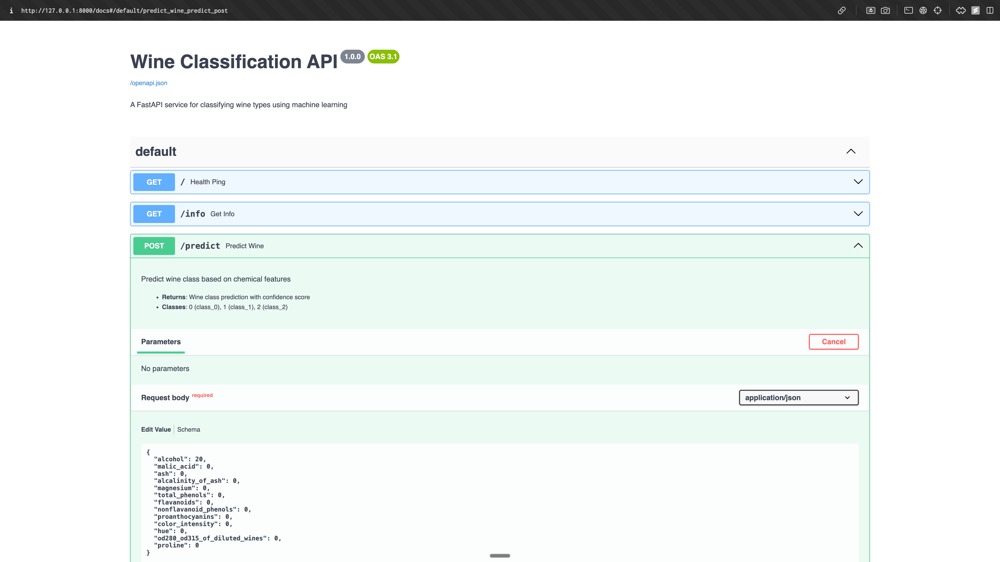
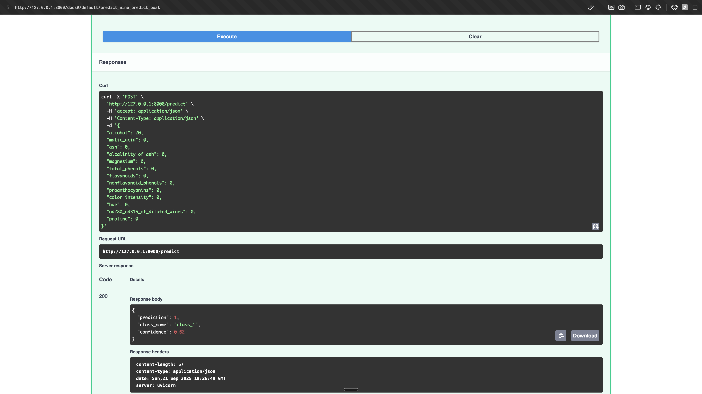
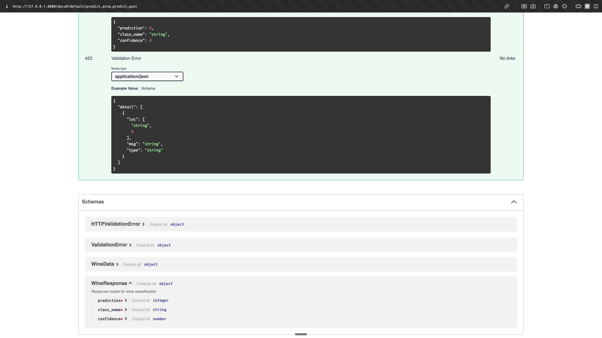

---
- Video Explanation: [FastAPI lab](https://www.youtube.com/watch?v=KReburHqRIQ&list=PLcS4TrUUc53LeKBIyXAaERFKBJ3dvc9GZ&index=4)
- Blog: [FastAPI Lab-1](https://www.mlwithramin.com/blog/fastapi-lab1)

**By Mohan Bhosale**

---

## Overview

In this Lab, we will learn how to expose ML models as APIs using [FastAPI](https://fastapi.tiangolo.com/) and [uvicorn](https://www.uvicorn.org/).
1. **FastAPI**: FastAPI is a modern, fast (high-performance), web framework for building APIs with Python based on standard Python type hints.
2. **uvicorn**: Uvicorn is an [Asynchronous Server Gateway Interface - ASGI](https://youtu.be/vKjCkeJGbNk) web server implementation for Python. It is often used to serve FastAPI aplications.

The workflow involves the following steps:
1. Training a Random Forest Classifier on Wine Dataset.
2. Serving the trained model as an API using FastAPI and uvicorn.

## 🍷 Wine Classification Dataset

This lab uses the **Wine Recognition Dataset** from scikit-learn, which contains:
- **178 samples** of wine with **13 chemical features**
- **3 different wine classes** (cultivars from the same region in Italy)
- **Features include**: alcohol content, acidity levels, color intensity, flavonoids, etc.

### Wine Dataset Features:
1. **alcohol**: Alcohol percentage
2. **malic_acid**: Malic acid content
3. **ash**: Ash content
4. **alcalinity_of_ash**: Alcalinity of ash
5. **magnesium**: Magnesium content
6. **total_phenols**: Total phenols
7. **flavanoids**: Flavanoids content
8. **nonflavanoid_phenols**: Non-flavanoid phenols
9. **proanthocyanins**: Proanthocyanins content
10. **color_intensity**: Color intensity
11. **hue**: Hue value
12. **od280_od315_of_diluted_wines**: OD280/OD315 ratio of diluted wines
13. **proline**: Proline content

### Wine Classes:
- **Class 0**: class_0 (First cultivar)
- **Class 1**: class_1 (Second cultivar)  
- **Class 2**: class_2 (Third cultivar)

## Setting up the lab

1. Create a virtual environment(e.g. **fastapi_env**).
   ```bash
   python3 -m venv fastapi_env
   ```
2. Activate the environment and install the required packages using `pip install -r requirements.txt`.
   ```bash
   source fastapi_env/bin/activate  # On macOS/Linux
   # or
   fastapi_env\Scripts\activate     # On Windows
   pip install -r requirements.txt
   ```

### Project structure

```
fastapi_labs
└── FastAPI_Labs
    ├── assets/
    ├── fastapi_env/
    ├── model/
    │   ├── wine_model.pkl      # Trained Random Forest model
    │   └── wine_scaler.pkl     # Feature scaler for preprocessing
    ├── src/
    │   ├── __init__.py
    │   ├── data.py             # Wine dataset loading and preprocessing
    │   ├── main.py             # FastAPI application with wine endpoints
    │   ├── predict.py          # Wine prediction logic with confidence scores
    │   └── train.py            # Random Forest training with evaluation
    ├── README.md
    └── requirements.txt
```

### Dependencies:
- **scikit-learn==1.5.1**: Machine learning library
- **fastapi[all]==0.111.1**: Web framework with all optional dependencies
- **pandas==2.0.3**: Data manipulation
- **numpy==1.24.3**: Numerical computing
- **uvicorn[standard]==0.23.2**: ASGI server
- **pydantic==2.4.2**: Data validation

## Running the Lab

1. **Step 1: Train the Random Forest Classifier**
   Navigate to the **src/** folder:
   ```bash
   cd src
   ```

2. **Step 2: Train the model**
   Run the training script to create the wine classification model:
   ```bash
   python train.py
   ```
   This will:
   - Load the wine dataset (178 samples, 13 features)
   - Split data into train/test sets (70/30)
   - Train a Random Forest classifier
   - Apply feature scaling for better performance
   - Save both `wine_model.pkl` and `wine_scaler.pkl`
   - Display model accuracy and classification report

3. **Step 3: Start the FastAPI server**
   To serve the trained model as an API:
   ```bash
   uvicorn main:app --reload
   ```

4. **Step 4: Access the API Documentation**
   After starting the server, you can access:
   - **Interactive API Docs**: [http://127.0.0.1:8000/docs](http://127.0.0.1:8000/docs)
   - **Alternative Docs**: [http://127.0.0.1:8000/redoc](http://127.0.0.1:8000/redoc)
   - **API Info**: [http://127.0.0.1:8000/info](http://127.0.0.1:8000/info)

### 🎯 Wine Classification API Interface

The interactive documentation provides a beautiful interface for testing the wine classification:



You can see all the wine features that need to be provided for classification, along with example values and field descriptions.

### 📋 API Schema Documentation

The API also provides comprehensive schema documentation for all data models:



This shows the WineData input model and WineResponse output model with all their properties and types.

### 🎯 API Endpoints

#### 1. Health Check
```bash
GET /
```
Response:
```json
{
  "status": "healthy",
  "service": "Wine Classification API",
  "version": "1.0.0"
}
```

#### 2. Service Information
```bash
GET /info
```
Response:
```json
{
  "service": "Wine Classification API",
  "description": "Classify wine types based on chemical analysis",
  "features": { "alcohol": "Alcohol percentage", ... },
  "classes": { "0": "class_0", "1": "class_1", "2": "class_2" },
  "model": "Random Forest Classifier",
  "features_count": 13
}
```

#### 3. Wine Classification
```bash
POST /predict
```
Request Body:
```json
{
  "alcohol": 14.23,
  "malic_acid": 1.71,
  "ash": 2.43,
  "alcalinity_of_ash": 15.6,
  "magnesium": 127.0,
  "total_phenols": 2.8,
  "flavanoids": 3.06,
  "nonflavanoid_phenols": 0.28,
  "proanthocyanins": 2.29,
  "color_intensity": 5.64,
  "hue": 1.04,
  "od280_od315_of_diluted_wines": 3.92,
  "proline": 1065.0
}
```

Response:
```json
{
  "prediction": 1,
  "class_name": "class_1",
  "confidence": 0.62
}
```

### 🍷 Successful Wine Prediction Example

Here's what a successful wine classification looks like in the API:



The API successfully classified the wine sample as **class_1** with a confidence score of **0.62** (62% confidence).

### 🧪 Testing the API

You can test the API using:

1. **Interactive Swagger UI**: Visit `/docs` and use the "Try it out" feature
2. **curl command**:
   ```bash
   curl -X POST "http://localhost:8000/predict" \
        -H "Content-Type: application/json" \
        -d '{
          "alcohol": 13.20,
          "malic_acid": 1.78,
          "ash": 2.14,
          "alcalinity_of_ash": 11.2,
          "magnesium": 100.0,
          "total_phenols": 2.65,
          "flavanoids": 2.76,
          "nonflavanoid_phenols": 0.26,
          "proanthocyanins": 1.28,
          "color_intensity": 4.38,
          "hue": 1.05,
          "od280_od315_of_diluted_wines": 3.40,
          "proline": 1050.0
        }'
   ```
3. **Postman**: Import the API and test endpoints
4. **Python requests**:
   ```python
   import requests
   
   url = "http://localhost:8000/predict"
   data = {
       "alcohol": 13.20,
       "malic_acid": 1.78,
       # ... other features
   }
   response = requests.post(url, json=data)
   print(response.json())
   ```

### FastAPI Syntax

- The instance of FASTAPI class can be defined as:
    ```bash
    app = FastAPI()
     ```
- When you run a FastAPI application, you often pass this app instance to an ASGI server uvicorn. The server then uses the app instance to handle incoming web requests and send responses based on the routes and logic you’ve defined in your FastAPI application.
- To run a FastAPI application, run:
    ```
    uvicorn main:app --reload
    ```
- In this command, **main** is the name of the Python file containing your app instance (without the .py extension), and **app** is the name of the instance itself. The **--reload** flag tells uvicorn to restart the server whenever code changes are detected, which is useful during development and should not be used in production.
- All the functions which should be used as API should be prefixed by **@app.get("/followed_by_endpoint_name")** or **@app.post("/followed_by_endpoint_name")**. This particular syntax is used to define route handlers (which function should handle an incoming request based on the URL and HTTP method), which are the functions responsible for responding to client requests to a given endpoint.
    1. **Decorator (@)**: This symbol is used to define a decorator, which is a way to dynamically add functionality to functions or methods. In FastAPI, decorators are used to associate a function with a particular HTTP method and path.
    2. **App Instance (app)**: This represents an instance of the FastAPI class. It is the core of your application and maintains the list of defined routes, request handlers, and other configurations.
    3. **HTTP Method (get, post, etc.)**: The HTTP method specifies the type of HTTP request the route will respond to. For example, get is used for retrieving data, and post is used for sending data to the server. FastAPI provides a decorator for each standard HTTP method, such as @app.put, @app.delete, @app.patch, and @app.options, allowing you to define handlers for different types of client requests. For detailed info refer to this webiste by [Mdn](https://developer.mozilla.org/en-US/docs/Web/HTTP/Methods).
    4. **Path/Endpoint ("/endpoint_name")**: This is the URL path where the API will be accessible. When a client makes a request to this path using the specified HTTP method, FastAPI will execute the associated function and return the response.
- Using **async** in FastAPI allows for non-blocking operations, enabling the server to handle other requests while waiting for I/O tasks, like database queries or model loading, to complete. This leads to improved concurrency and resource utilization, enhancing the application's ability to manage multiple simultaneous requests efficiently.

### 🍷 Enhanced Data Models for Wine Classification

#### 1. WineData class (Input Model)

```python
class WineData(BaseModel):
    alcohol: float = Field(..., description="Alcohol percentage", ge=0, le=20)
    malic_acid: float = Field(..., description="Malic acid content", ge=0)
    ash: float = Field(..., description="Ash content", ge=0)
    alcalinity_of_ash: float = Field(..., description="Alcalinity of ash", ge=0)
    magnesium: float = Field(..., description="Magnesium content", ge=0)
    total_phenols: float = Field(..., description="Total phenols", ge=0)
    flavanoids: float = Field(..., description="Flavanoids content", ge=0)
    nonflavanoid_phenols: float = Field(..., description="Non-flavanoid phenols", ge=0)
    proanthocyanins: float = Field(..., description="Proanthocyanins content", ge=0)
    color_intensity: float = Field(..., description="Color intensity", ge=0)
    hue: float = Field(..., description="Hue value", ge=0)
    od280_od315_of_diluted_wines: float = Field(..., description="OD280/OD315 ratio", ge=0)
    proline: float = Field(..., description="Proline content", ge=0)
```

The **WineData** class is a [Pydantic model](https://docs.pydantic.dev/latest/concepts/models/) with enhanced features:
- **Field Validation**: Uses `Field()` with constraints (ge=0 means "greater than or equal to 0")
- **Documentation**: Each field has a description for auto-generated API docs
- **Type Safety**: Ensures all 13 wine features are provided and valid
- **Input Validation**: Automatically validates ranges and data types
- **Example Data**: Includes sample wine data for API documentation

#### 2. WineResponse class (Output Model)

```python
class WineResponse(BaseModel):
    prediction: int = Field(..., description="Predicted wine class (0, 1, or 2)")
    class_name: str = Field(..., description="Name of the predicted wine class")
    confidence: float = Field(..., description="Prediction confidence score (0-1)")
```

The **WineResponse** class provides enhanced prediction information:
- **prediction**: The numerical class (0, 1, or 2)
- **class_name**: Human-readable class name (class_0, class_1, class_2)
- **confidence**: Prediction confidence score (0.0 to 1.0)
- **Rich Documentation**: Self-documenting API responses

---

### FastAPI features

1. **Request Body Reading**: When a client sends a request to a FastAPI endpoint, the request can include a body with data. For routes that expect data (commonly POST, PUT, or PATCH requests), this data is often in JSON format. FastAPI automatically reads the request body by checking the Content-Type header, which should be set to application/json for JSON payloads.
2. **Data Conversion**: Once the request body is read, FastAPI utilizes Pydantic models to parse the JSON data. Pydantic attempts to construct an instance of the specified model using the data from the request body. During this instantiation, Pydantic converts the JSON data into the proper Python data types as declared in the model.
    - For instance, if the JSON object has a field like petal_length with a value of "5.1" (a string), and the model expects a float, Pydantic will transform the string into a float. If conversion isn't possible (say, the value was "five point one"), Pydantic will raise a validation error.
3. **Data Validation**: Pydantic checks that all required fields are present and that the values are of the correct type, adhering to any constraints defined in the model (such as string length or number range). If the validation passes, the endpoint has a verified Python object to work with. If validation fails (due to missing fields, incorrect types, or constraint violations), FastAPI responds with a 422 Unprocessable Entity status. This response includes a JSON body detailing the validation errors, aiding clients in correcting their request data.
4. **Error Handling**: Error handling in FastAPI can be effectively managed using the HTTPException class. HTTPException is used to explicitly signal an HTTP error status code and return additional details about the error. When an HTTPException is raised within a route, FastAPI will catch the exception and use its content to form the HTTP response.
- **Instantiation**: The HTTPException class is instantiated with at least two arguments: status_code and detail. The status_code argument is an integer that represents the HTTP status code (e.g., 404 for Not Found, 400 for Bad Request). The detail argument is a string or any JSON-encodable object that describes the error.
- **Response**: When an HTTPException is raised, FastAPI sends an HTTP response with the status code specified. The detail provided in the HTTPException is sent as the body of the response in JSON format.

```python
from fastapi import FastAPI, HTTPException

app = FastAPI()

@app.get("/items/{item_id}")
async def read_item(item_id: int):
    item = get_item_by_id(item_id)  # Hypothetical function to fetch an item
    if item is None:
        raise HTTPException(status_code=404, detail=f"Item with ID {item_id} not found")
    return item
```

In this example, **get_item_by_id** is a function that retrieves an item based on its ID. If no item with the given ID is found, an HTTPException with a 404 Not Found status code is raised, and the detail message is customized to include the ID of the item that was not found.

FastAPI will catch this exception and return a response with a 404 status code and a JSON body like this:

```json
{
    "detail": "Item with ID 1 not found"
}
```
- For more information on how to handle errors in FASTAPI refer to this [documentation](https://fastapi.tiangolo.com/tutorial/handling-errors/).

---

## 🚀 Key Improvements in Wine Classification Lab

This enhanced version includes several improvements over the basic iris classification:

### 1. **More Complex Dataset**
- **13 features** instead of 4 (more realistic ML scenario)
- **Wine chemistry analysis** (real-world domain)
- **Feature scaling** for improved model performance

### 2. **Better Machine Learning**
- **Random Forest** instead of Decision Tree (more robust)
- **Cross-validation** and performance evaluation
- **Confidence scores** in predictions
- **Feature preprocessing** with StandardScaler

### 3. **Enhanced API Features**
- **Field validation** with constraints and descriptions
- **Multiple endpoints** (health, info, predict)
- **Rich error handling** with specific error messages
- **Comprehensive documentation** with examples
- **Input validation** with range checks

### 4. **Production-Ready Features**
- **Detailed logging** and model performance metrics
- **Modular code structure** with separation of concerns
- **Comprehensive error handling** for model loading failures
- **API versioning** and service information
- **Example data** for easy testing

### 5. **Developer Experience**
- **Auto-generated API docs** with field descriptions
- **Interactive testing** via Swagger UI
- **Multiple testing methods** (curl, Python, Postman)
- **Clear setup instructions** and dependency management

---

## 🎉 Conclusion

This enhanced Wine Classification API demonstrates a complete machine learning deployment pipeline using FastAPI. The project successfully showcases:

- **Advanced ML Model Serving** with Random Forest classifier
- **Production-Ready API Design** with comprehensive validation
- **Interactive Documentation** with real-time testing capabilities
- **Enhanced Features** including confidence scores and detailed error handling

The API provides a robust foundation for deploying machine learning models in production environments! 🍷✨
